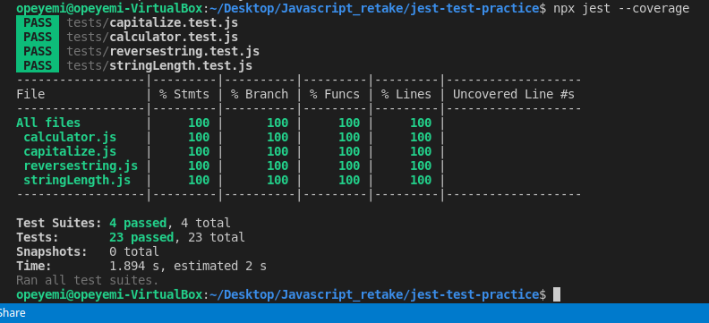

# Jest-test-practice

This is an exercise to apply to impement unit tests for JavaScript functions using the Jest library and following the AAA pattern.



## Built With

- HTML, CSS, JavaScript, Jest & Webpack;
- Visual Studio, Git & GitHub;

## Getting Started

To run this project, you only need to follow these steps:

1. In your terminal, type the following, to clone this repository:

```sh
$ git clone git@github.com:Adedayoopeyemi/jest-test-practice.git
```

2. After, run the following commands in your terminal:

```sh
$ cd JavaScript-Tests
npm install
npm test
```

## Author

 **Opeyemi Oyelesi**

- GitHub: [@AdedayoOpeyemi](https://github.com/AdedayoOpeyemi)
- Twitter: [@Oyelesiopy](https://twitter.com/oyelesiopy)
- Linkedin: [Opeyemi Oyelesi](https://www.linkedin.com/in/opeyemioyelesi/)

## 🤝 Contributing

Contributions, issues, and feature requests are welcome!

Feel free to check the [issues page](https://github.com/AdedayoOpeyemi/jest-test-practice/issues).

## Show your support

Give a ⭐️ if you like this project!

## 📝 License

This project is [MIT](./LICENSE) licensed.